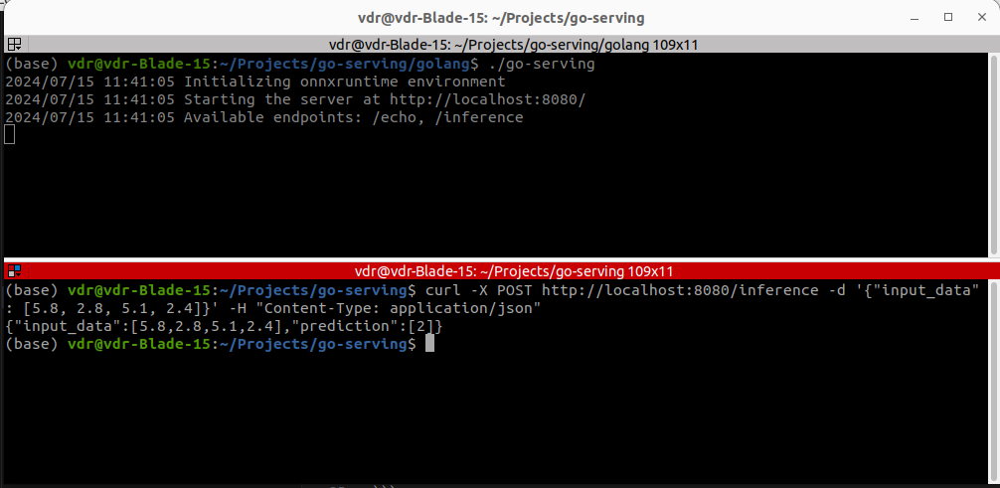

# Go Serving
## About
This project trains a simple ML model in Python and serves it via HTTPS in Golang.

### Python
Trained sklearn ML model is converted to ONNX format using [skl2onnx converter](https://onnx.ai/sklearn-onnx/) and stored in the `models/` directory. <br>
Install the requirements in a new virtual environment and run the following command:
```angular2html
python3 python/train.py
```

### Go
ONNX model is loaded using [onnxruntime_go wrapper](https://github.com/yalue/onnxruntime_go/) and served via HTTPS.<br>
For reproducing make sure you have `go` installed and run the following commands:
```angular2html
cd golang

go build -o go-serving main.go

./go-serving
```
Open a new terminal and paste the following request:
```angular2html
curl -X POST http://localhost:8080/inference -d '{"input_data": [5.8, 2.8, 5.1, 2.4]}' -H "Content-Type: application/json"
```

Example input/output:
